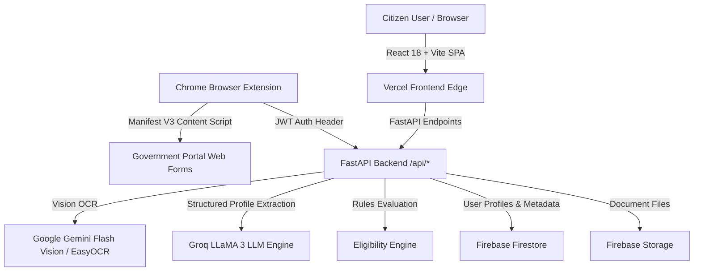

# 🏛️ SAHAYAK (सहायक / ସହାୟକ)
### *AI-Powered Citizen Welfare Discovery, Document Extraction & Form Autofill Platform*

[](https://sahayak-seven-rho.vercel.app)
[](https://fastapi.tiangolo.com)
[](https://react.dev)
[](https://vitejs.dev)
[](https://groq.com)
[](https://ai.google.dev)
[](https://sahayak-seven-rho.vercel.app)

---

## 📌 Overview

**SAHAYAK** (*"Helper"* in Hindi & Odia) is a digital public infrastructure assistant designed to eliminate bureaucratic hurdles for Indian citizens. It bridges the gap between underprivileged citizens and government welfare schemes through automated document parsing, deterministic eligibility matching, plain-language translations, and instant form auto-filling.

### 🌐 Live Links
- **Production Web Application**: [https://sahayak-seven-rho.vercel.app](https://sahayak-seven-rho.vercel.app)
- **Official GitHub Repository**: [https://github.com/Shashankpr17/SAHAYAK](https://github.com/Shashankpr17/SAHAYAK)
- **Interactive Test Form**: [https://sahayak-seven-rho.vercel.app/test-form.html](https://sahayak-seven-rho.vercel.app/test-form.html)

---

## ✨ Core Features

### 1. 🪪 Intelligent Multi-Document OCR & Profile Extraction
- **Supported IDs**: Aadhaar Card, PAN Card, Voter ID (EPIC), Driving Licence, Family Income Certificates.
- **Two-Stage AI Extraction Pipeline**:
  - **Stage 1 (Vision OCR)**: Preprocessed image bytes passed to Google Gemini Flash Vision / EasyOCR for raw text detection.
  - **Stage 2 (Structured Extraction)**: Raw text transformed by Groq LLM (LLaMA 3 / Mixtral) into a clean, canonical citizen profile schema.
- **Non-Destructive Profile Merging**: Automatically combines data across multiple document scans without overwriting existing verified attributes.
- **Non-Blocking Review**: Flexible review flow where fields without residential address (such as PAN or front-only ID scans) do not block citizen onboarding.

### 2. 🎯 Deterministic Welfare Scheme Eligibility Engine
- Evaluates citizen age, annual income thresholds, land ownership, occupation category, and state against official central and state government schemes.
- Categorizes programs into **Eligible for You**, **May Be Eligible**, and **More Information Needed**.
- Provides explainable, human-readable match criteria for every single recommendation.

### 3. 💳 Beneficiary & Credit Value Badges
- High-visibility credit amount chips displayed across scheme cards and scheme detail headers.
- Displays exact financial subsidies, monthly pensions, insurance coverage limits, and direct benefit transfer (DBT) amounts.

### 4. 🗣️ Trilingual Vernacular Engine & Jargon Translator
- Native support for **English**, **Hindi (हिंदी)**, and **Odia (ଓଡ଼ିଆ)**.
- **"Explain Simply" Mode**: Translates complex government notifications into clear, actionable advice free of legalistic jargon.

### 5. 🧩 SAHAYAK Chrome Extension (Manifest V3)
- Reads the verified citizen profile directly from the cloud backend.
- Intelligently detects and auto-fills web forms on any portal (`.gov.in`, state portals, university portals).
- Features dynamic field scoring, fuzzy label matching, multi-format DOB conversion (`DD/MM/YYYY`, `YYYY-MM-DD`, `DD-MM-YYYY`), and radio/dropdown handling.
- Free side-loaded distribution package (`.zip`) with interactive 3-step setup modal.

---

## 🏛️ Government Schemes Catalog (12+ Schemes)

| Scheme ID | Scheme Name | Category | Benefit / Credit Value | Official Portal |
| :--- | :--- | :--- | :--- | :--- |
| `pm-kisan` | **PM-KISAN** | Agriculture | ₹6,000 / year (3 installments of ₹2,000) | [pmkisan.gov.in](https://pmkisan.gov.in/) |
| `pmjay` | **Ayushman Bharat (PM-JAY)** | Health & Insurance | Up to ₹5,00,000 / year (Cashless cover) | [pmjay.gov.in](https://pmjay.gov.in/) |
| `pmjjby` | **PM Jeevan Jyoti Bima (PMJJBY)** | Life Insurance | ₹2,00,000 life insurance cover | [jansuraksha.gov.in](https://jansuraksha.gov.in/) |
| `pmsby` | **PM Suraksha Bima (PMSBY)** | Accident Insurance | ₹2,00,000 accidental insurance cover | [jansuraksha.gov.in](https://jansuraksha.gov.in/) |
| `pmkmy` | **PM Kisan Maandhan (PMKMY)** | Pension / Agriculture | ₹3,000 / month pension after age 60 | [maandhan.in](https://maandhan.in/) |
| `pmfby` | **PM Fasal Bima (PMFBY)** | Agriculture | Up to 100% crop loss sum insured | [pmfby.gov.in](https://pmfby.gov.in/) |
| `nmmss` | **National Means-cum-Merit (NMMSS)** | Education | ₹12,000 / year (Class 9 to 12) | [scholarships.gov.in](https://scholarships.gov.in/) |
| `student-scholarship` | **Post-Matric Higher Education** | Education | ₹12,000/yr (UG) to ₹20,000/yr (PG) | [scholarships.gov.in](https://scholarships.gov.in/) |
| `pmegp` | **PM Employment Generation (PMEGP)** | Employment | Up to ₹50L (Mfg) / ₹20L (Service) with 15–35% subsidy | [kviconline.gov.in](https://www.kviconline.gov.in/pmegpeportal/) |
| `pmmy` | **Pradhan Mantri Mudra (PMMY)** | Business Loan | Mudra loans up to ₹10 Lakh (collateral-free) | [mudra.org.in](https://www.mudra.org.in/) |
| `pmay-u` | **PM Awas Yojana (Urban)** | Housing | Up to ₹2.50L–₹2.67L interest subsidy | [pmaymis.gov.in](https://pmaymis.gov.in/) |
| `pmay-g` | **PM Awas Yojana (Gramin)** | Housing | ₹1.20L–₹1.30L direct grant + MGNREGA wages | [pmayg.nic.in](https://pmayg.nic.in/) |
| `teacher-welfare` | **Teacher Welfare Assistance** | Education / Welfare | Financial aid up to ₹50,000 | [edudel.nic.in](https://edudel.nic.in/) |

---

## 🛠️ Architecture & Technology Stack



### 💻 Frontend
- **Framework**: React 18, TypeScript, Vite
- **Routing**: React Router v6 with fallback SPA routing (`_redirects` & `dist/vercel.json`)
- **State Management**: React Hooks, Context API (`LanguageContext`), `localStorage`, `sessionStorage`
- **Design System**: Vanilla CSS design tokens, HSL palette, Material Symbols, glassmorphism, responsive mobile-first grid

### ⚡ Backend API
- **Framework**: FastAPI (Python 3.11+)
- **Serverless Runtime**: Vercel Serverless Functions (`backend/api/index.py`)
- **Authentication**: Google OAuth2 (`google-auth`) + Guest Session Tokens (JWT)
- **Database & Storage**: Firebase Firestore & Firebase Storage (`firebase-admin`)
- **AI & OCR**: Groq Cloud SDK (`groq`), Google Generative AI (`google-generativeai`), EasyOCR, Pillow (`PIL`), PyPDF

### 🧩 Browser Extension
- **Platform**: Chromium Manifest V3 (Chrome, Brave, Edge)
- **Features**: Background Service Worker, Content Scripts with DOM field scoring, popup profile sync, auto-fill triggering

---

## 📡 API Endpoints Reference

| Method | Route | Description | Auth Required |
| :--- | :--- | :--- | :--- |
| `POST` | `/api/auth/google` | Verify Google ID token & issue session JWT | No |
| `POST` | `/api/auth/guest` | Issue guest session token for demo access | No |
| `GET` | `/api/profile` | Retrieve verified citizen profile | Yes (Bearer JWT) |
| `POST` | `/api/profile` | Save / update verified profile fields | Yes (Bearer JWT) |
| `POST` | `/api/documents/extract` | Upload document image/PDF, run OCR + AI extraction | Yes (Bearer JWT) |
| `GET` | `/api/schemes` | List master government schemes catalog | No |
| `GET` | `/api/schemes/{id}` | Get complete formal information for a scheme | No |
| `GET` | `/api/eligibility` | Evaluate eligibility using saved profile in Firestore | Yes (Bearer JWT) |
| `POST` | `/api/eligibility` | Evaluate eligibility against arbitrary profile payload | No |
| `GET` | `/api/explain/{id}` | Get vernacular explanation & official portal link | No |
| `GET` | `/api/health` | Service health check | No |

---

## 🚀 Local Development Setup

### Prerequisites
- **Node.js** (v18.0+) & **npm** (v9.0+)
- **Python** (v3.10+) & **pip**
- **Git**

### 1. Clone the Repository
```bash
git clone https://github.com/Shashankpr17/SAHAYAK.git
cd SAHAYAK
```

### 2. Frontend Setup
```bash
# Install dependencies
npm install

# Start Vite development server
npm run dev
```
The frontend application will be available at `http://localhost:5173`.

### 3. Backend Setup
```bash
cd backend

# Create and activate virtual environment
python3 -m venv venv
source venv/bin/activate   # On Windows: venv\Scripts\activate

# Install Python requirements
pip install -r requirements.txt

# Run FastAPI backend locally
uvicorn api.index:app --reload --port 8000
```
The interactive Swagger API documentation will be available at `http://127.0.0.1:8000/docs`.

### 4. Environment Variables Configuration

Create a `.env` file in `backend/`:
```env
ENVIRONMENT=development
ALLOWED_ORIGINS=http://localhost:5173,http://localhost:5174,http://127.0.0.1:5173
GOOGLE_CLIENT_ID=your_google_client_id.apps.googleusercontent.com
SESSION_SECRET=your_secret_session_key
GROQ_API_KEY=gsk_your_groq_api_key
GEMINI_API_KEY=your_gemini_vision_api_key
```

---

## 📦 Chrome Extension Installation Guide

1. Open **SAHAYAK** in your browser and click **Add Extension** (or download `public/sahayak-extension.zip`).
2. Extract the `.zip` file on your computer.
3. Open Google Chrome and navigate to `chrome://extensions`.
4. Enable **Developer mode** toggle in the top-right corner.
5. Click **Load unpacked** in the top-left corner and select the extracted `extension/` folder.
6. Open any government form (e.g. [SAHAYAK Test Form](https://sahayak-seven-rho.vercel.app/test-form.html)), open the SAHAYAK extension popup, and click **Auto-Fill This Form**!

---

## 🔒 Security & Privacy

- **Masked PII**: Sensitive identification numbers (Aadhaar, PAN, Voter ID) are masked by default on the client and in the extension popup.
- **Stateless Verification**: Scanned document files are processed securely for field extraction and can be managed directly by the user.
- **CORS Protection**: API routes are strictly restricted to verified production domains and local development origins.

---

## 👥 Contributors & Maintainers

- **Shashank Prashant** 
- **Saikrishna Pal**
---

## 📄 License

This project is licensed under the [MIT License](LICENSE). Built for citizen empowerment and public welfare digital transformation.
